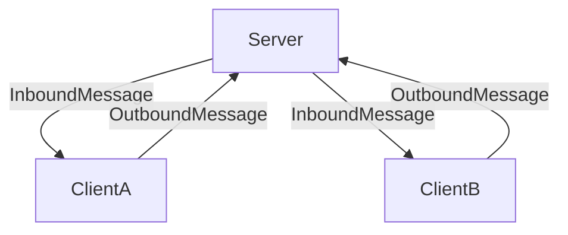
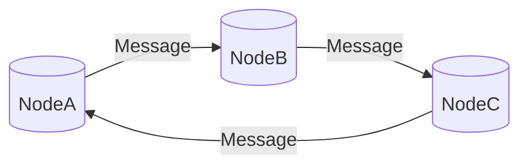

# Synk

![badge][badge-android]
![badge][badge-jvm]

---

A Kotlin multiplatform CRDT library for building offline/local first applications.


Synk supercharges client side databases to have distributed database properties such as:

- Conflict Resolution
- Causal Ordering

_Allowing you to build offline first applications with the technologies you're familiar with._


# How does it work?

Synk is a state based CRDT library, it monitors state changes over time using a special type of [timestamp](https://github.com/CharlieTap/hlc) which is capable
of tracking events in a distributed system (your application). Synk maintains this data in its own persistent key value storage database locally on each client.
It's important to understand Synk **does not** store your data, merely it stores timestamps associated with it.

Unlike most CRDT libraries Synk works entirely agnostic to your data persistence technology, you can think of it as
something that can be bolted on to your application as opposed to something that would replace your core data layer
technology. What this means in practice is you can use whatever data persistence technology you like (Maybe Room or
SQLDelight) and Synk can complement it by tracking extra metadata which is crucial for resolving conflicts.

Synk behaves as a middle man between your local database and other databases in your application, for this reason
it exposes two functions:

### Outbound

```kotlin
Synk.outbound(new: T, old: T? = null): Message<T>
```

Whenever a new record/object is created or updated in your application locally, give synk the latest version and the old version (if applicable) and synk will return you a message.
This message needs to be propagated to all other clients.

### Inbound

```kotlin
Synk.inbound(message: Message<T>, old: T? = null): T
```

When receiving a Message from another client application, inbound needs to be called. This function will perform conflict resolution for you and return an instance of your object ready to
be persisted.

Typical usage can be seen as a loop where Inbound completes the process started by Outbound, for example:

1. Client A database creates a Foo record
2. Synk running on Client A is alerted to this change through the `outbound` function creating a Message
3. Message is propagated to the Server from Client A as part of a synchronisation process
4. Client B runs syncronisation process and receives the Message
5. Synk running on Client B is alerted to the message through the `inbound` function, this performs conflict resolution
and returns an object
6. Object is inserted into Client B's database, replacing any previous state that may exist




# How should I architect my application using Synk

Synk is intentionally minimal and unopinionated in design, but there are of course some constraints that come from building an application with it.
The two that stand out are the following:

- Messages must be relayed to all nodes in order for state to be consistent
- Data exposed to Synk can never be deleted, at least not in the short term, soft deletes using tombstone fields is the recommended solution.


Offline first applications that mutate state are distributed systems, there's no two ways about it. For this reason Synk has no concept of server like central storage.
Synk sees the world how any node in a distributed system would.


# API Usage

---

## Gradle

Synk currently uses Jitpack to distribute artifacts, you'll need to ensure that the jitpack maven repo is configured
in you dependency resolution management block.

```kotlin
dependencyResolutionManagement {
    repositories {
        ...
        maven(url = "https://jitpack.io" )
```

You'll need both Synk runtime and the delightful metastore artifacts to get started:

```kotlin
dependencies {
    implementation("com.github.charlietap.synk:delight-metastore:xxx")
    implementation("com.github.charlietap.synk:synk:xxx")
}
```
Alternatively if you're working with a KMP project you can pull the specialised dependencies for the different targets:

```kotlin
dependencies {
    implementation("com.github.charlietap.synk:synk-android:xxx")
    //or
    implementation("com.github.charlietap.synk:synk-jvm:xxx")
}
```

## Synk

Synk maintains two pieces of state in order to function:

- A logical clock, the location of this file is configured through ClockStorageConfiguration
- A key value database called the MetaStore, you can provide an instance of the DelightfulMetastoreFactory. This factory
uses Sqldelight under the hood and needs a Sqldriver to function. Depending on your platform you will need to provide the
appropriate driver, you can read how to do this [here](https://cashapp.github.io/sqldelight/1.5.4/multiplatform_sqlite/)

```kotlin
val clockStorageConfig = ClockStorageConfiguration(
    filePath = "/synk".toPath(),
    fileSystem = FileSystem.SYSTEM
)
val factory = DelightfulMetastoreFactory(driver)
val synk = Synk.Builder(clockStorageConfig)
    .metaStoreFactory(factory)
    .build()
```

If you're on Android a preset extension function exists for the builder which configures the clock storage configuration for you:

```kotlin
val synk = Synk.Builder.Presets.Android(context)
.metaStoreFactory(metastoreFactory)
.build()
```


### Synk Adapters

Synk adapters tell synk how to serialize and deserialize types into generic maps it can perform conflict resolution on. For
every type T you intend to use with Synk you must provide a SynkAdapter<T> when constructing your synk instance.

```kotlin
val synk = Synk.Builder(...)
    .registerSynkAdapter(adapter)
    .registerSynkAdapter(adapter2)
    .build()
```

For more information on Synk adapters please visit the [documentation page](docs/synk-adapters.md)

## Conflict Resolution, Causal Ordering and Messages

Synk resolves conflicts by recording a causal order of events in the Metastore. Calls to the `inbound` and `outbound`
functions are checked against the current state of the Metastore and conflict resolution is performed.

Local events are events that occur on the current node (client application), notify Synk of the event by passing the new
and old (in the case of updates) to outbound once they have already been persisted to the database.

Synk will return you a Message, it's your responsibility to ensure all nodes receive all messages relevant to them.

```kotlin
Synk.outbound(new: T, old: T? = null): Message<T>
```

`inbound` is the ying to `outbound`'s yang, and the destination for the Messages `outbound` creates. The result of inbound is an object ready to be inserted into a database, free of conflicts and consistent across all nodes.


```kotlin
Synk.inbound(message: Message<T>, old: T? = null): T
```

## Change Detection

Coming soon ...

## Serialization

To aid the relay of messages between applications Synk provides methods for serializing Messages to and from json.
These serializers make use of the Synk adapters provided and tend to have better performance than reflections powered
serializers like gson.

```kotlin
Synk.serialize(messages: List<Message<T>>): String
```

```kotlin
Synk.deserialize(encoded: String): List<Message<T>>
```

For those looking to serialize messages themselves, Synk exposes Message/Meta Serializers for popular libs:

- [Kotlin Serialization](docs/extensions.md#kotlinx-serialization)

## Compaction

Messages generated by Synk are commutative, associative and idempotent. This means that you can combine the messages in any order you want,
however many times as you want, switching which messages combine with each other, and you will always deterministically get the same result.

This affords us the ability to merge a series of messages for a particular object into just one, it's latest state. You could for example batch all the messages
regarding a particular object whilst offline, then compact all the changes into one Message before relaying this information to other nodes.

Taking this idea further you could store all the Messages ever created in an Event Store, and compact them to derive the current state of the system.


```kotlin
Synk.compact(messages: List<Message<T>>): List<Message<T>>
```

## Testing

Synk is designed from the ground up to be testable, by default Synk will use in memory metastore for metadata persistence.
You can easily configure a test friendly instance as follows:

```kotlin
val storageConfiguration = StorageConfiguration(
    filePath = "/test".toPath(),
    fileSystem = FakeFileSystem()
)

val testSynk = Synk.Builder(storageConfiguration)
    .build()
```

## Additional Reading

- [Synking all the things with CRDTs](https://dev.to/charlietap/synking-all-the-things-with-crdts-local-first-development-3241)


[badge-android]: http://img.shields.io/badge/-android-6EDB8D.svg?style=flat
[badge-jvm]: http://img.shields.io/badge/-jvm-DB413D.svg?style=flat
[badge-js]: http://img.shields.io/badge/-js-F8DB5D.svg?style=flat
[badge-linux]: http://img.shields.io/badge/-linux-2D3F6C.svg?style=flat
[badge-windows]: http://img.shields.io/badge/-windows-4D76CD.svg?style=flat
[badge-ios]: http://img.shields.io/badge/-ios-CDCDCD.svg?style=flat
[badge-mac]: http://img.shields.io/badge/-macos-111111.svg?style=flat


## License

This project is dual-licensed under both the MIT and Apache 2.0 licenses. You can choose which one you want to use the software under.

- For details on the MIT license, please see the [LICENSE-MIT](LICENSE-MIT) file.
- For details on the Apache 2.0 license, please see the [LICENSE-APACHE](LICENSE-APACHE) file.
