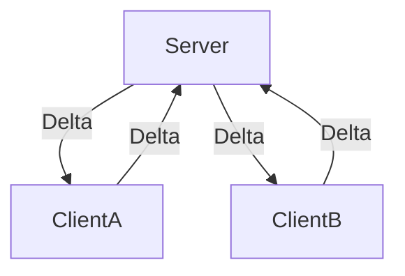

# Contacts δ-CRDT Demo

This demo project exhibits a distributed system which propagates delta based CRDT state changes.

The server is merely a relay for the clients, it aggregates an event source of all delta changes propagated from each client.

Clients serve as nodes in the system, they create information locally first before propagating their state changes
to others. The clients are capable of operating entirely offline from the network, the CRDT conflict 
resolution algorithm guarantees eventual consistency.

Each client features the following:

- A SQLite database which functions as a [GSet](https://en.wikipedia.org/wiki/Conflict-free_replicated_data_type#G-Set_(Grow-only_Set)) of LWW Maps
- A [HybridLogicalClock](https://cse.buffalo.edu/tech-reports/2014-04.pdf) to help maintain the causal ordering between events of its own and those of other clients
- A delta generator process which simulates the creation, mutation and deletion of contacts 
- A synchronisation message queue which has all jobs serialised to disk, ensuring that no messages will ever be dropped.

# Architecture



# On disk data representation

On each client a SQLite database is maintained.

```sqlite
CREATE TABLE contact (
    id TEXT PRIMARY KEY,
    name TEXT NOT NULL,
    name_timestamp TEXT NOT NULL,
    phone TEXT NOT NULL,
    phone_timestamp TEXT NOT NULL,
    email TEXT NOT NULL,
    email_timestamp TEXT NOT NULL,
    tombstone TEXT NOT NULL,
    tombstone_timestamp TEXT NOT NULL
);
```

You can imagine each row to be an entry in GSet, meaning it can never be deleted.   
Deletions from the table are managed by the tombstone field, meaning we really only soft delete data.
The set determines the identity of each element by an id, in this case the contacts id.  

Each element in the GSet is in fact an LWW Map.

To illustrate this, imagine the following Contacts data structure:

```json
{
  "id": "123e4567-e89b-12d3-a456-426614174000",
  "name": "Bob",
  "phone": "555777889",
  "email": "boo@foo.com",
  "tombstone": "0"
}
```

This structure is in fact a map, for example **name**, **phone** are keys and Bob, 555777889 are values   
In order to create a Last Write Wins map we need a timestamp against each value. Note that we have omitted id here,
only mutable values need to be synchronised.


```json
{
  "name": { "value": "Bob", "timestamp": "123456789"},
  "phone": { "value": "555777889", "timestamp": "123456789"},
  "email": { "value": "boo@foo.com", "timestamp": "123456789"},
  "tombstone": { "value": "0", "timestamp": "123456789"}
}
```

To avoid normalisation and the associated performance dip we chose to flatten the structure 
rather than normalise the value and the timestamp into a sub table. Et Voilà

```json
{
  "name": "Bob",
  "name_timestamp": "123456789",
  "phone": "555777889",
  "phone_timestamp": "123456789",
  "email": "boo@foo.com",
  "email_timestamp": "123456789",
  "tombstone": "0",
  "tombstone_timestamp": "123456789"
}
```

# Synchronisation δ-CRDT

Delta based CRDTs synchronise themselves using messages which encode the 
delta effect of mutations.

For example if we changed Bob's name to Jim, the message would have the following 
structure.

```json
{
  "id": "123e4567-e89b-12d3-a456-426614174000",
  "timestamp": "123456789",
  "column": "name",
  "value": "Jim"
}
```

# Further work

This demo is designed to be simple and thus there's lots of optimisations that could be made:

- The original paper on Delta based CRDTs talks of CRDT delta intervals, which are essentially the aggregation 
of multiple deltas into a single latest delta for a particular property. This is particularly beneficial when adding
a new node into a system with a lot of existing events, rather than replaying the event source you can replay just the 
latest delta for each property.
- Currently nodes transmit the latest event they have seen using an auto-incrementing integer on the server.
. This works well in the situation wherefore you have just a centralised server and a non sharded database but less so otherwise. 

# Acknowledgements

- This system is heavily inspired by James Long's [CRDT's for mortals](https://www.youtube.com/watch?v=DEcwa68f-jY) 
- The HLC implementation can be found [here](https://github.com/CharlieTap/hlc) 


