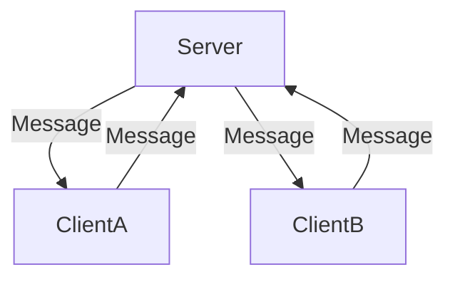

# Synk

![badge][badge-android]
![badge][badge-jvm]

Synk is a library that seeks to have as little impact on your application architecture as possible, it's goal is to provide:

- Conflict Resolution
- Causal Ordering

Allowing you to build offline first applications the way you want to, with the technologies you're familiar with.


# How does it work?

Synk is a state based CRDT library, it monitors state changes over time using a special type of [timestamp](https://github.com/CharlieTap/hlc)  which is capable 
of tracking events in a distributed system (your application). Synk maintains this data in its own persistent key value storage database,
it's important to understand synk does not store your data, merely it stores timestamps associated with it.

In order for Synk to work, it needs to be informed of when state is created or updated in your application. It exposes two functions for this purpose:

```kotlin
Synk.outbound(new: T, old: T? = null): Message<T>
```

Whenever a new record/object is created or updated in your application locally, give synk the latest version and the old version (if applicable) and synk will return you a message.
This message needs to be propagated to all other clients.

```kotlin
Synk.inbound(message: Message<T>, old: T? = null): T 
```

When receiving a Message from another client application, inbound needs to be called. This function will perform conflict resolution for you and return an instance of your object ready to
be persisted.


# How should I build 

Offline first applications that mutate state are distributed systems 





# API Usage


[badge-android]: http://img.shields.io/badge/-android-6EDB8D.svg?style=flat
[badge-jvm]: http://img.shields.io/badge/-jvm-DB413D.svg?style=flat
[badge-js]: http://img.shields.io/badge/-js-F8DB5D.svg?style=flat
[badge-linux]: http://img.shields.io/badge/-linux-2D3F6C.svg?style=flat
[badge-windows]: http://img.shields.io/badge/-windows-4D76CD.svg?style=flat
[badge-ios]: http://img.shields.io/badge/-ios-CDCDCD.svg?style=flat
[badge-mac]: http://img.shields.io/badge/-macos-111111.svg?style=flat
